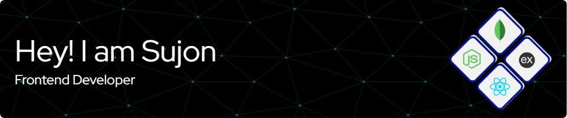

## :computer: About Me :
I'm Md Sujon Miah, a self-taught programmer with a passion for learning new things. I'm particularly interested in building web applications and I enjoy the challenge of turning ideas into functional code. I'm currently working on improving my skills in JavaScript and learning more about Next.js.

## :hammer_and_wrench: Tools and Technologies :
<table align="left">
  <tr>
    <td align="center" width="96">
         JavaScript
    </td>
    <td align="center" width="96">
         TypeScript
    </td>
    <td align="center" width="96">
         React.js
    </td>
     <td align="center" width="96">
         Next.js
    </td>
    <td align="center" width="96">
         Express.js
    </td>
   <td align="center" width="96">
         MongoDB
    </td>
  </tr>
  <tr>
    <td align="center" width="96">
         Sass
    </td>
    <td align="center" width="96">
       Tailwind
    </td>
   <td align="center" width="96">
         Bootstrap
    </td>
    <td align="center" width="96">
         Firebase
   </td>
   <td align="center" width="96">
         Git
   </td>
   <td align="center" width="96">
         Postman
   </td>
  </tr>
</table>
